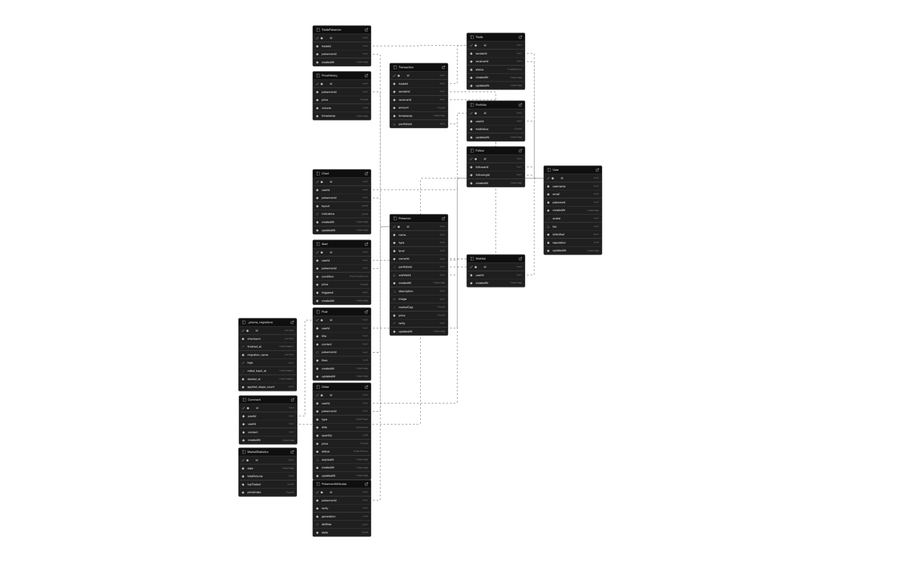

<p align="center">
  
</p>

# 🏆 PokeTrade

**PokeTrade** is a Pokémon trading platform inspired by TradingView. Pokémon prices fluctuate in a simulated market
where users can buy, sell, and track price trends just like real traders.

---

## 🏗️ Project Architecture

```
├── .env.example
├── .gitignore
├── .husky
    ├── .gitignore
    ├── commit-msg
    └── pre-commit
├── .prettierignore
├── .prettierrc
├── README.md
├── bun.lock
├── commitlint.config.js
├── components.json
├── eslint.config.mjs
├── next.config.ts
├── package.json
├── postcss.config.mjs
├── public
    ├── assets
    │   └── images
    │   │   ├── auth
    │   │       └── auth-bg.png
    │   │   └── readme
    │   │       ├── logo.png
    │   │       └── logo2.png
    ├── file.svg
    ├── globe.svg
    ├── next.svg
    ├── vercel.svg
    └── window.svg
├── src
    ├── app
    │   ├── (auth)
    │   │   ├── layout.tsx
    │   │   ├── login
    │   │   │   └── page.tsx
    │   │   └── register
    │   │   │   └── page.tsx
    │   ├── (root)
    │   │   ├── layout.tsx
    │   │   └── page.tsx
    │   ├── favicon.ico
    │   ├── globals.css
    │   └── layout.tsx
    ├── components
    │   └── ui
    │   │   ├── button.tsx
    │   │   ├── card.tsx
    │   │   ├── chart.tsx
    │   │   ├── checkbox.tsx
    │   │   ├── form.tsx
    │   │   ├── input-otp.tsx
    │   │   ├── input.tsx
    │   │   ├── label.tsx
    │   │   ├── select.tsx
    │   │   ├── separator.tsx
    │   │   ├── skeleton.tsx
    │   │   ├── sonner.tsx
    │   │   ├── switch.tsx
    │   │   └── textarea.tsx
    ├── lib
    │   ├── services
    │   │   └── pokeApi.service.ts
    │   ├── types
    │   │   └── pokemon.types.ts
    │   ├── utils.ts
    │   └── validators
    │   │   └── authSchema.ts
    └── utils
    │   └── supabase
    │       ├── client.ts
    │       ├── middleware.ts
    │       └── serveur.ts
└── tsconfig.json

```

## 🚀 Tech Stack

- **Framework**: [Next.js 15 (App Router)](https://nextjs.org)
- **Backend-as-a-Service**: [Supabase](https://supabase.com)
- **Database**: PostgreSQL (via Supabase)
- **UI/UX**: Tailwind CSS, shadcn/ui
- **Form Validation**: Zod
- **Testing**: Jest, Cypress
- **CI/CD**: GitHub Actions
- **Payments**: Stripe

---

## 🎯 Features

- 🔐 Supabase Authentication
- 📈 Price charts for each Pokémon
- 🛒 Trading system (buy/sell)
- 💳 Subscription payments via Stripe
- 💼 User portfolio management
- 📊 Transaction history
- ✅ Responsive & stylish UI

---

## 🧱 SOLID Architecture

This project follows SOLID principles:

- **S**: Separate domains in `/core/domain`
- **O**: Extendable entities using Zod
- **L**: Clearly defined interfaces for services
- **I**: Interfaces specific to each feature
- **D**: Dependency injection for use cases

---

## 🧱 UML Architecture

<p align="center">
  
</p>

## 🔍 Conventional Commits

This project follows the **Conventional Commits** standard to maintain a consistent commit message format. Commit
messages must follow this structure:

```
<type>(<scope>): <subject>
```

### Commit Message Structure

- **type**: Describes the type of change (e.g., `feat`, `fix`, `docs`)
- **scope**: Specifies the affected area (e.g., `auth`, `build`)
- **subject**: A concise description of the change

### Allowed Types

| Type     | Description                                 |
|----------|---------------------------------------------|
| feat     | A new feature                               |
| fix      | A bug fix                                   |
| docs     | Documentation updates                       |
| style    | Code formatting (no logic changes)          |
| refactor | Code restructuring without behavior changes |
| perf     | Performance improvements                    |
| test     | Adding or updating tests                    |
| chore    | Build process or auxiliary tool changes     |
| ci       | CI configuration changes                    |
| build    | Build system updates                        |
| revert   | Reverting a previous commit                 |

### Examples

- `feat(auth): Add login functionality`
- `fix(api): Resolve timeout issue`
- `docs(readme): Update setup instructions`
- `chore(deps): Update dependency versions`
- `style(button): Adjust padding for better alignment`

Commit messages that do not follow this format will be rejected to ensure a clean, readable history.

---

## 🛠️ Installation

```bash
git clone https://github.com/your-username/poketrade.git
cd poketrade
npm install
cp .env.example .env.local
```

Configure `.env.local`:

```env
NEXT_PUBLIC_SUPABASE_URL=''
NEXT_PUBLIC_SUPABASE_ANON_KEY=''
```

---

## 🚀 Running the Project

```bash
npm run dev
```

---

## ✅ Testing

### Jest (Unit Tests)

```bash
npm run test
```

### Cypress (End-to-End Tests)

```bash
npx cypress open
```

---

## 🔄 CI/CD

GitHub Actions automatically runs tests:

- Linting + Jest on each `push`
- Deployment via Vercel (or another platform, depending on configuration)

---

## 🔗 NFT Smart Contract Development and Integration

# 1. Designing and Developing Smart Contracts to Accept Payments in the Form of NFTs

**Main Contract: `PaymentNFT.sol`**

- Allows a user to pay in Ether (`payAndMint()`) to receive an NFT.  
- Emits a `NFTMinted(address indexed minter, uint256 indexed tokenId, uint256 amount)` event.  
- Includes a `withdraw()` function enabling the owner to withdraw funds.

### Progress

**Current state**:  
- The contract is developed in Solidity
- It compiles successfully (Hardhat).  
- Basic unit tests confirm NFT minting, amount verification, and fund withdrawal.

**Note**:  
- Utilizing OpenZeppelin ensures compliance with the ERC721 standard and applies best practices for Ownable management.
- The `payAndMint()` method does not necessarily enforce a fixed amount (you are free to implement `require(msg.value == ...)` if needed).

---

# 2. Deployment on a Test Network and Preparing for the Main Network

**Targeted Testnet**: Sepolia, via `hardhat.config.js`.

**Configuration**:
```js
networks: {
  sepolia: {
    url: process.env.SEPOLIA_RPC_URL,
    accounts: [process.env.PRIVATE_KEY]
  },
}
```
Deployment script: ```scripts/deploy.js```

### Progress
**Current state**:  

- The Hardhat configuration (```hardhat.config.js```) is ready.
- Unit tests (locally) pass successfully.
- Missing: test ETH (Sepolia ETH) to actually deploy on the test network.

**Next steps**:

1. Obtain test ETH via a faucet (e.g., [sepoliafaucet.com](https://sepoliafaucet.com) or [faucetlink.to/sepolia](https://faucetlink.to/sepolia)).

2. Run the command:
```bash
npx hardhat run scripts/deploy.js --network sepolia
```
3. Check the contract address on an explorer (e.g., [sepolia.etherscan.io](https://sepolia.etherscan.io)).

**Mainnet migration**:

- Same logic, adding a ```mainnet``` block in ```hardhat.config.js``` and providing real ETH.
- Do this after final validation (tests, audit, etc.).

# 3. Integration with the Supabase Back End

**Objective**:

- Listen for the ```NFTMinted``` event from the contract to link the NFT transaction to a user profile 
- Insert into a table: the minter’s address, the tokenId, the transaction, etc.

### Progress
**Current state**:  

- The event-listening logic (```contract.on("NFTMinted", ...)```) has been explained but not yet implemented in the existing code.
- We have an example of inserting data into Supabase (```supabase.from("...").insert([...])```).

**Next steps**:

1. Create or adapt a script (Node/Next.js) that listens to the blockchain (Ethers.js) via a provider (Sepolia).
2. Insert data into the Supabase database.
3. Implement front-end or back-end display to show minted NFTs.

# 4. Implementation of Unit and Integration Tests (Security and Robustness)

**Unit Tests**:

- Implemented in test/PaymentNFT.test.js.
- Verify ```payAndMint()```, ```withdraw()```, and revert if ```msg.value == 0```.
- Run successfully on local Hardhat.

**Integration Tests**:

- **Locally**: A "simplified" test checks if the owner can retrieve funds (contract balance = 0, owner balance increases).
- **Next steps**: test real integration with Supabase (event listening).
- **Optionally**: test on **Sepolia** for more realistic behavior.

# 5. Documentation of the Architecture and Workflow
##### 1. Smart Contracts (Solidity)

- ✅ `PaymentNFT` contract developed, handles minting an NFT in exchange for payment.
- ✅ Hardhat unit tests to verify basic logic (payment/mint, withdrawal).

##### 2. Testnet Deployment

- ❌ Obtain test ETH on **Sepolia**.
- ❌ Deploy via Hardhat (`scripts/deploy.js`).
- ❌ Verify the address and code on Etherscan.

##### 3. Supabase Integration

- ❌ Create a listener script (`contract.on("NFTMinted", ...)`), insert into DB.
- ❌ Connect with the front-end (display minted NFT in **PokeTrade**).

##### 4. Security & Audit

- ❌ Check for reentrancy (if needed), correct use of **Ownable**, etc.
- ❌ Optional: third-party audit before deploying to mainnet.

##### 5. Documentation

- ✅ Partial documentation exists (testing, configuration).
- ❌ Finalize a more complete README or Wiki, include diagrams, testnet/mainnet deployment instructions.


## 🧩 Key Technologies

| Technology | Usage                 |
|------------|-----------------------|
| Next.js    | App router, SSR/ISR   |
| Supabase   | Auth, DB, Realtime    |
| Stripe     | Subscription payments |
| Zod        | Schema validation     |
| Jest       | Unit testing          |
| Cypress    | End-to-end testing    |
| Tailwind   | CSS design system     |
| shadcn/ui  | UI components         |

---

## 👥 Contributors

- [Your Name](https://github.com/your-github)
- You can be listed here too! 😉

---

## 📜 License

MIT
